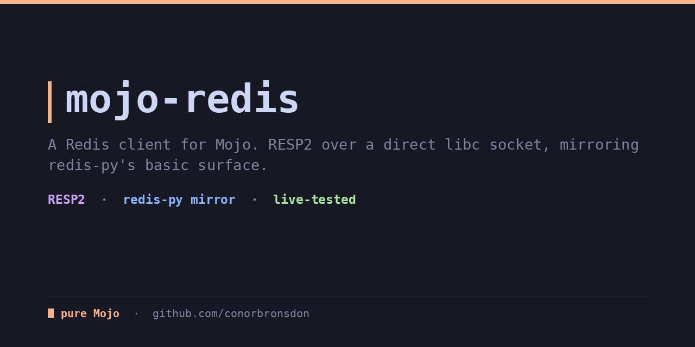
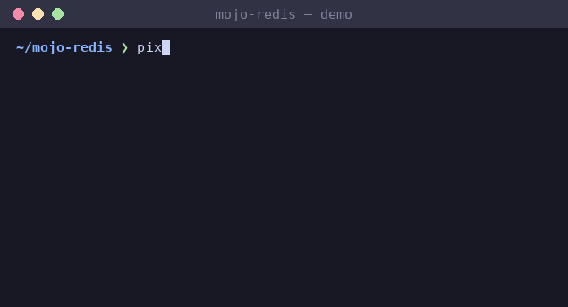

<div align="center">

# mojo-redis

**A Redis client for Mojo, mirroring redis-py's basic surface. RESP2 over a direct libc socket, no third-party networking dependency.**

[](LICENSE)
[](https://mojolang.org)
[](https://chainofthought.show)
[](https://x.com/ConorBronsdon)




</div>

As of mid-2026 the Mojo ecosystem has no Redis client. mojo-redis fills
that gap with a small, synchronous client that speaks RESP2 directly over
a TCP socket. The surface is deliberately
[`redis-py`](https://redis.readthedocs.io/)-shaped, so if you know the
Python client, this reads the same.

```mojo
from redis import Redis

def main() raises:
    var r = Redis("127.0.0.1", 6379)     # or Redis.connect()
    _ = r.set("greeting", "hello", ex=60)  # value with a 60s expiry
    print(r.get("greeting").value())       # -> hello
    _ = r.rpush("tasks", "a")
    _ = r.rpush("tasks", "b")
    print(r.lrange("tasks", 0, -1))        # -> [a, b]
    r.close()
```

### Coming from Python

If you know `redis-py`, the client methods map directly:

| Python (`redis-py`)                 | mojo-redis                             |
| ----------------------------------- | -------------------------------------- |
| `r = redis.Redis(host, port)`       | `var r = Redis(host, port)`            |
| `r.set("k", "v")`                   | `r.set("k", "v")`                      |
| `r.set("k", "v", ex=60)`            | `r.set("k", "v", ex=60)`               |
| `r.get("k")`                        | `r.get("k").value()`                   |
| `r.incr("k")` / `r.decr("k")`       | `r.incr("k")` / `r.decr("k")`          |
| `r.hset("h", "f", "v")` / `r.hgetall("h")` | `r.hset("h", "f", "v")` / `r.hgetall("h")` |

One difference: `get` returns an `Optional[String]`, so call `.value()` when
the key exists (or test the optional with `Bool(...)` for a miss) rather than
getting a bare string or `None`.

## What it handles

- **RESP2 protocol**: a serializer for command arrays and a parser for
  all five reply types (simple string, error, integer, bulk string
  including nil, and array including nested and nil). The parser is
  incremental-safe: a reply split across several `recv` calls is
  reassembled and decoded correctly.
- **redis-py-shaped API**: `get`, `set` (with `ex=` expiry), `delete` /
  `delete_keys`, `exists`, `incr`, `decr`, `expire`, `ttl`, `keys`,
  `ping`, `lpush` / `rpush` / `lpop` / `rpop` / `lrange`, `hset` / `hget`
  / `hgetall`, and `flushdb`. Values that can be absent come back as
  `Optional[String]`; counters as `Int`; list replies as `List[String]`;
  hashes as `Dict[String, String]`.
- **Escape hatch**: `execute(["ANY", "COMMAND", ...])` returns the raw
  `RespValue` for anything without a typed wrapper.
- **Pipelining**: queue commands into a `Pipeline` and flush them in one
  round trip with `execute_pipeline`, getting the replies back in order.
- **Errors surface as exceptions**: a RESP error reply (`-ERR ...`) is
  raised as a Mojo `Error` rather than returned as a silently wrong value.
- **Transport**: a blocking IPv4 TCP socket opened via direct libc
  `external_call` (`socket`, `connect`, `send`, `recv`, `close`), with no
  networking library dependency. See below on why not
  [flare](https://github.com/ehsanmok/flare).

## What it deliberately does NOT do

- **No TLS, no `AUTH` helper.** Connections are plaintext. You can still
  authenticate manually with `execute(["AUTH", ...])`.
- **No DNS.** `host` is a dotted-quad IPv4 address or the literal
  `localhost`. Hostname resolution isn't wired up yet.
- **No timeouts / no async.** Sockets are blocking; calls wait as long as
  the server takes.
- **No connection pool, no automatic reconnect, no RESP3.**

## Why not flare

flare, the Mojo networking stack, ships as a pixi git dependency built with
`pixi-build`. This project, like its siblings, uses a plain `uv` + `mojo`
toolchain with no pixi-build machinery, so pulling flare in cleanly was
the painful path. Direct FFI to the POSIX socket API is roughly 80 lines,
has no third-party dependency, and is a well-trodden pattern. The libc
call signatures and the Linux `sockaddr_in` byte layout follow flare's
(MIT-licensed) `flare/net` socket module for reference; no flare source is
vendored. The whole backend lives behind one `Connection` struct, so a
future flare-backed or `io_uring` transport can drop in without touching
the protocol layer or the client.

## Install

Add it to a pixi workspace, or point the compiler at `src/` with `-I src`
as the tasks below do. Requires a Mojo nightly (`>=1.0.0b3`).

## Usage

```mojo
from redis import Redis

def main() raises:
    var r = Redis.connect()             # defaults to 127.0.0.1:6379

    _ = r.set("counter", "10")
    print(r.incr("counter"))            # 11

    _ = r.hset("user:1", "name", "Conor")
    var user = r.hgetall("user:1")      # Dict[String, String]

    # Pipeline: one round trip, replies in order.
    var pipe = Redis.pipeline()
    pipe.set("p", "1")
    pipe.incr("p")
    pipe.get("p")
    var replies = r.execute_pipeline(pipe)
    print(replies[2].as_string())       # "2"

    r.close()
```

## Tests

Two layers:

1. **Protocol unit tests** (`test/test_resp.mojo`): pure and
   network-free. RESP serialize/parse round-trips, split-buffer
   (incremental) parsing, nil handling, nested arrays, error replies.
   34 tests. This is what CI runs.

   ```bash
   pixi run test     # or: mojo run -I src test/test_resp.mojo
   ```

2. **Integration tests** (`test/test_integration.mojo`): the full stack
   against a live Redis server. 21 tests covering every client method,
   unicode round-trips, and a value larger than the recv buffer (which
   forces multi-`recv` incremental parsing over the real socket). Not run
   in CI (no server there).

   ```bash
   redis-server --port 6399 --daemonize yes --save "" --appendonly no
   REDIS_PORT=6399 pixi run test-integration
   ```

Both suites pass: 34 protocol tests plus 21 live-Redis integration tests.

## Layout

```
src/redis/
  resp.mojo        RESP2 serializer + incremental parser (the value core)
  connection.mojo  libc TCP socket transport (swappable Connection)
  client.mojo      Redis + Pipeline, the redis-py-shaped API
test/
  test_resp.mojo         protocol unit tests (no network)
  test_integration.mojo  live-server integration tests
examples/
  demo.mojo        a quick tour of the client
```

## Part of a pure-Mojo library suite

Eleven pure-Mojo libraries that mirror familiar Python stdlib and PyPI APIs,
filling gaps in the native Mojo ecosystem:

- [mojo-xml](https://github.com/conorbronsdon/mojo-xml) — general-purpose XML
  parsing, an ElementTree-shaped DOM (Python's `xml.etree.ElementTree`)
- [mojo-feed](https://github.com/conorbronsdon/mojo-feed) — RSS, Atom, and
  JSON Feed parsing (Python's `feedparser`)
- [mojo-captions](https://github.com/conorbronsdon/mojo-captions) — SRT and
  WebVTT subtitle/transcript parsing (no Python stdlib parallel)
- [mojo-html](https://github.com/conorbronsdon/mojo-html) — HTML parsing and
  article extraction (Python's readability)
- [mojo-markdown](https://github.com/conorbronsdon/mojo-markdown) —
  CommonMark markdown parsing (Python's `markdown`)
- [mojo-unicodedata](https://github.com/conorbronsdon/mojo-unicodedata) —
  Unicode normalization and case folding (Python's `unicodedata`)
- [mojo-diff](https://github.com/conorbronsdon/mojo-diff) — text diffing
  (Python's `difflib`)
- [mojo-template](https://github.com/conorbronsdon/mojo-template) — a
  Jinja-flavored template engine (Python's `jinja2`)
- [mojo-tar](https://github.com/conorbronsdon/mojo-tar) — tar archive
  reading and writing (Python's `tarfile`)
- [mojo-url](https://github.com/conorbronsdon/mojo-url) — URL parsing
  and encoding (Python's `urllib.parse`)

## Contributing

Issues and PRs welcome, especially real-world command coverage gaps and
transport edge cases (partial reads, connection drops). Run
`pixi run test` before sending a PR; if you can run a local Redis server,
`pixi run test-integration` too.

## About

Built by [Conor Bronsdon](https://conorbronsdon.com) — host of
[Chain of Thought](https://chainofthought.show), a podcast about AI agents,
infrastructure, and engineering. Find me on [X](https://x.com/ConorBronsdon)
or [LinkedIn](https://www.linkedin.com/in/conorbronsdon).

---

## Disclaimer

*All views, opinions, and statements expressed on this account/in this repo are solely my own and are made in my personal capacity. They do not reflect, and should not be construed as reflecting, the views, positions, or policies of Modular. This account is not affiliated with, authorized by, or endorsed by my employer in any way.*

## License

Licensed under the [MIT License](LICENSE).
